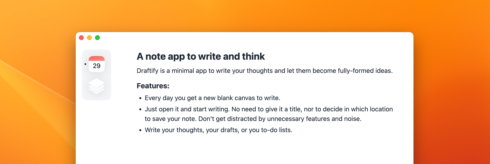

# Draftify

- [Download for Mac (Apple Silicon)](https://draftify.vercel.app/download/latest/mac-silicon.dmg)
- [Download for Mac (Intel)](https://draftify.vercel.app/download/latest/mac-intel.dmg)

---

Draftify is a minimal note and journal app (Mac only). It's a place to quickly write ideas and to think.

Draftify is a mindful note app aimed to be a calm place for your passing thoughts, ideas, and to-do lists.
By opening the app, every day you are given a fresh new note onto which jot down stuff. The note is then archived and a new empty one is created the next day. You can easily go back and see the notes from the previous days (and eventually delete them).

### Features

- Markdown support, including checklists and code blocks
- Quick Search functionality
- Keyboard shortcuts
- Notes are stored locally

---

## Development

#### Repo structure

| Dir         | Description                                    |
| ----------- | ---------------------------------------------- |
| `/client`   | App client (CRA) and Electron rendered process |
| `/electron` | Electron main process                          |
| `/shared`   | Shared types and utilities                     |
| `/website`  | Marketing website (TBD)                        |
